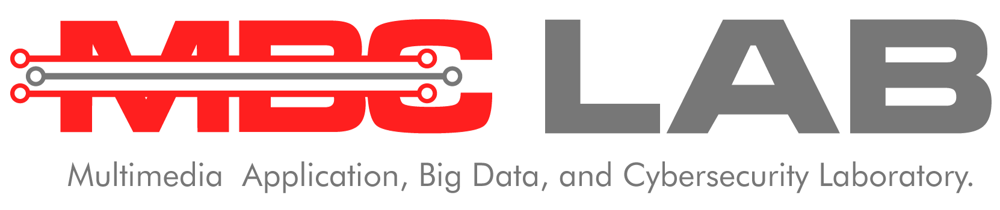

# Danny Aulia

Hi there! 👋

Bachelor of Telecommunication Engineering. Interest in advancements of technologies.

## About Me

Bachelor of Telkom University 

Head Assistant of Signal Processing for Intelligent Systems 

Practicum Assistant of Multimedia Application, Big Data, and Cybersecurity 

Committee & Technical Staff of ASEAN 2023 

## Social Media

<!--
**dannyauliaa/dannyauliaa** is a ✨ _special_ ✨ repository because its `README.md` (this file) appears on your GitHub profile.

Here are some ideas to get you started:

# 🔭 I’m currently working on myself it
- 🌱 I’m currently learning ...
- 👯 I’m looking to collaborate on ...
- 🤔 I’m looking for help with ...
- 💬 Ask me about ...
- 📫 How to reach me: ...
- 😄 Pronouns: ...
- ⚡ Fun fact: ...
-->
